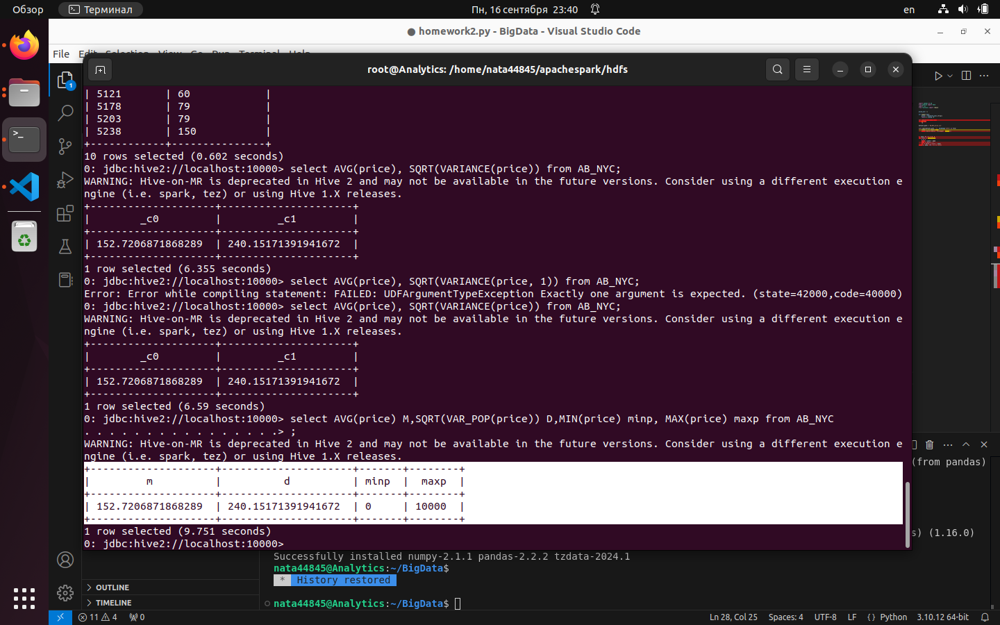

# Задание 2
## Скачиваем файл и преобразуем в файл из двух столбцов без заголовка

homework2.ipynb

## Закачиваем файл на hive-server, создаем таблицу, закачиваем данные, делаем запрос
```
cd apachespark/
cd hdfs/
sudo docker-compose up -d
docker cp /home/nata44845/BigData/AB_NYC_price.csv hive-server:/
docker exec -it hive-server beeline -u jdbc:hive2://localhost:10000

CREATE TABLE AB_NYC (id int, price int) row format delimited fields terminated by ',';

LOAD DATA LOCAL INPATH '/AB_NYC_price.csv' OVERWRITE INTO TABLE AB_NYC;

select count(*) from AB_NYC;
48895


select AVG(price), VARIANCE(price) from AB_NYC;

+--------------------+---------------------+
|        _c0         |         _c1         |
+--------------------+---------------------+
| 152.7206871868289  | 240.15171391941672  |
+--------------------+---------------------+

select AVG(price) M,SQRT(VAR_POP(price)) D,MIN(price) minp, MAX(price) maxp from AB_NYC;

+--------------------+---------------------+-------+--------+

|         m          |          d          | minp  |  maxp  |

+--------------------+---------------------+-------+--------+

| 152.7206871868289  | 240.15171391941672  | 0     | 10000  |

+--------------------+---------------------+-------+--------+
```





Проверка mapReduce

homework2.py

```
import csv
from functools import reduce


price_col = 1

def mapper(row):
    price = int(row[price_col].strip())
    return 1, price, None

def reducer(score1, score2):
    scores = []
    if score1[2] == None:
        n, mean, M2 = 0, 0.0, 0
        scores.append(score1[1])
    else:
        n, mean, M2 = score1
    scores.append(score2[1])

    for score in scores:
        n += 1
        delta = score - mean
        mean += delta / n
        M2 += delta * (score - mean)
    return n, mean, M2

dataset_path = 'AB_NYC_price.csv'

with open(dataset_path, "r", encoding='utf8') as file:
    reader = csv.reader(file)
    n, mean, M2 = reduce(reducer, map(mapper, reader))
    print(f'{n=}, {mean=}, D={(M2 / n) ** (1/2)}')
```

n=48895, mean=152.72068718682823, D=240.15171391941672